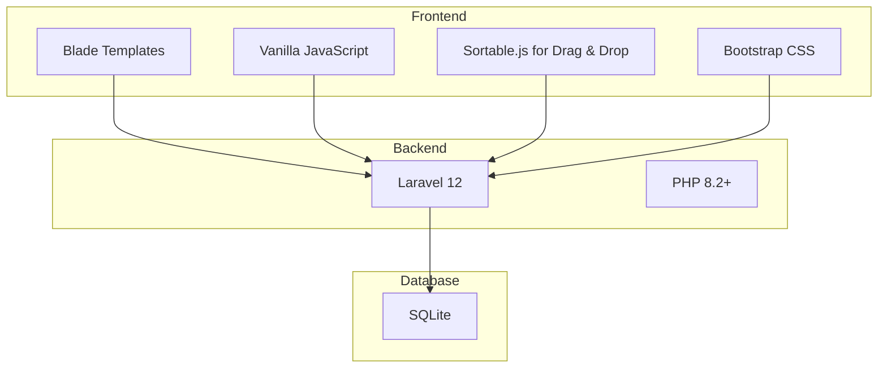

<p align="center"><a href="https://laravel.com" target="_blank"></a></p>

<p align="center">
<a href="https://github.com/laravel/framework/actions"></a>
<a href="https://packagist.org/packages/laravel/framework"></a>
<a href="https://packagist.org/packages/laravel/framework"></a>
<a href="https://packagist.org/packages/laravel/framework"></a>
</p>

# Laravel Kanban Board

A simple, interactive Kanban board application built with Laravel and vanilla JavaScript. This project serves as a demonstration of Laravel best practices, including the use of Policies, Form Requests, and a clean, maintainable code structure.

## ✨ Features

- **User Authentication:** Secure user registration and login.
- **Board Management:** Create, edit, and delete Kanban boards.
- **Interactive Lists & Cards:**
  - Default lists (`To Do`, `In Progress`, `Done`) are created with each new board.
  - Add, edit, and delete cards within lists.
  - Drag-and-drop cards between lists to update their status.
- **Authorization:** Users can only view and manage their own boards.
- **Validation:** Robust server-side validation using Form Requests.

## 🛠️ Tech Stack

This project is built on the TALL stack philosophy, but with a vanilla JS frontend for simplicity.



## 🚀 Getting Started

Follow these instructions to get a copy of the project up and running on your local machine.

### Prerequisites

- PHP >= 8.2
- Composer
- Node.js & NPM
- A local web server environment (e.g., Laravel Valet, Herd, or `php artisan serve`)

### Installation & Setup

1.  **Clone the repository:**
    ```bash
    git clone git@github.com:williamhatch/laravel_kanban_demo.git
    cd laravel_kanban_demo
    ```

2.  **Install dependencies:**
    ```bash
    composer install
    npm install
    ```

3.  **Set up your environment file:**
    ```bash
    cp .env.example .env
    ```

4.  **Generate an application key:**
    ```bash
    php artisan key:generate
    ```

5.  **Create the SQLite database file:**
    ```bash
    touch database/database.sqlite
    ```
    *Note: The `.env` file is pre-configured to use this SQLite database.*

6.  **Run database migrations:**
    ```bash
    php artisan migrate
    ```

7.  **Build frontend assets:**
    ```bash
    npm run dev
    ```

8.  **Run the development server:**
    In a separate terminal, run:
    ```bash
    php artisan serve
    ```

You can now access the application at **http://localhost:8000**.

## ✅ Testing

This project uses PHPUnit for testing.

### Running the Test Suite

To run the full test suite, use the following command:

```bash
php artisan test
```

### Running Tests in Watch Mode

> **Can tests be run in watch mode?**
>
> Yes! While PHPUnit doesn't have a built-in watch mode, you can use a tool like [Pest](https://pestphp.com/) (which is compatible with PHPUnit tests) or a file watcher.
>
> For a simple, dependency-free approach, you can use a command-line file watcher like `chokidar-cli`.
>
> 1.  **Install `chokidar-cli` globally:**
>     ```bash
>     npm install -g chokidar-cli
>     ```
> 2.  **Run this command in your project root:**
>     ```bash
>     chokidar "**/*.php" -c "clear && php artisan test"
>     ```
> This command will watch all `.php` files and re-run your test suite whenever a file is changed.

### Test Coverage

To generate a test coverage report, you first need to install and enable **Xdebug** in your PHP environment.

**1. Install Xdebug:**

The recommended way is using PECL:
```bash
pecl install xdebug
```
Then, make sure you enable it in your `php.ini` file by adding the line `zend_extension=xdebug`.

**2. Run Coverage Report:**

Once Xdebug is set up, simply run the test suite with the coverage flag:

```bash
php artisan test --coverage
```

This will generate a detailed HTML report inside the `tests/coverage/` directory. Open the `index.html` file in that directory to explore the report. It will also display a summary directly in your terminal.

## 🤝 Contributing

We welcome contributions! If you find a bug or have a feature request, please follow these steps:

1.  **Check for existing issues:** Search the [Issues](https://github.com/williamhatch/laravel_kanban_demo/issues) tab to see if your issue has already been reported.
2.  **Open a new issue:** If it's a new issue, please open one, providing a clear title and a detailed description.
    -   For **bugs**, include steps to reproduce, expected behavior, and actual behavior.
    -   For **features**, describe the proposed functionality and its benefits.

## 📄 License

This project is open-sourced software licensed under the [MIT license](https://opensource.org/licenses/MIT).
